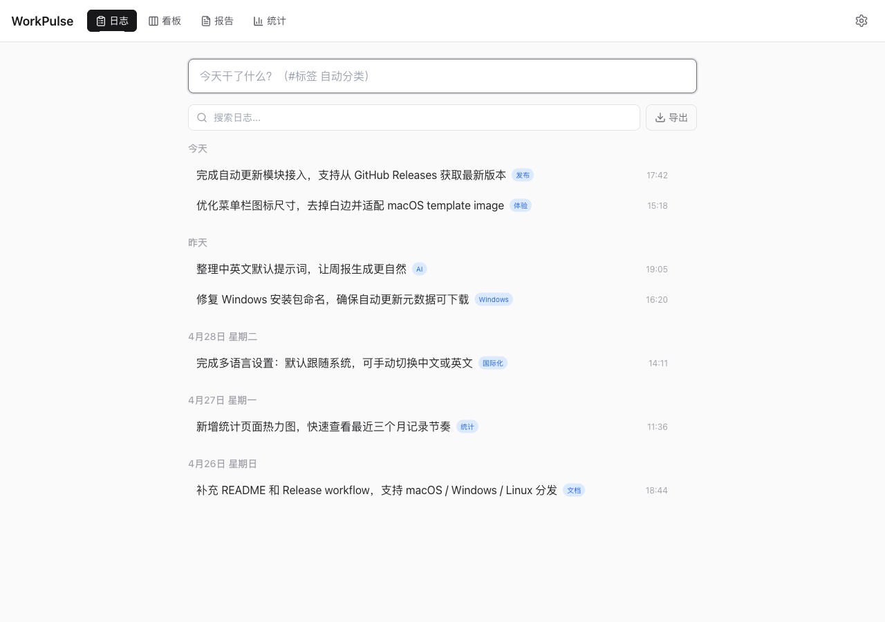
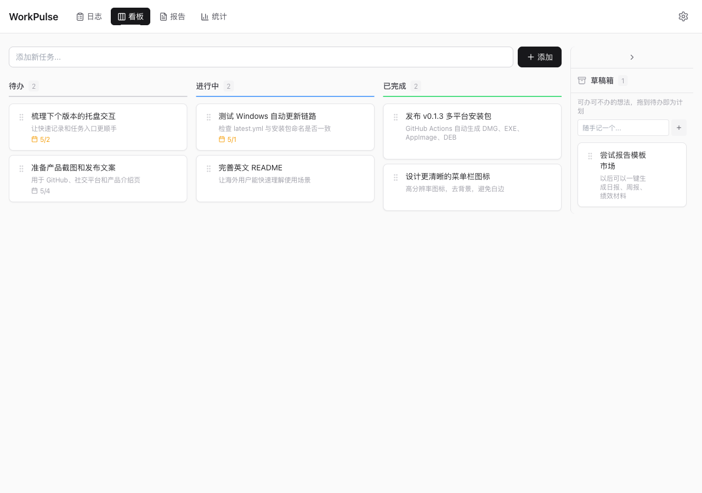
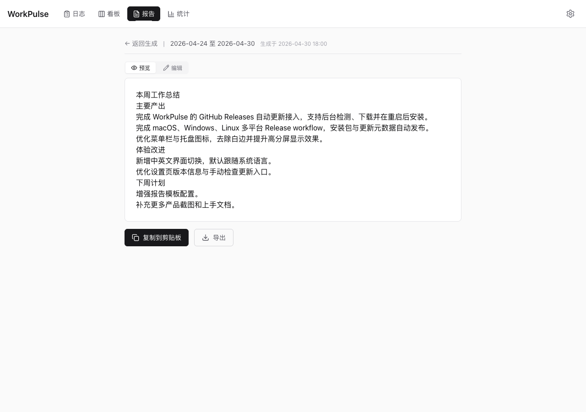
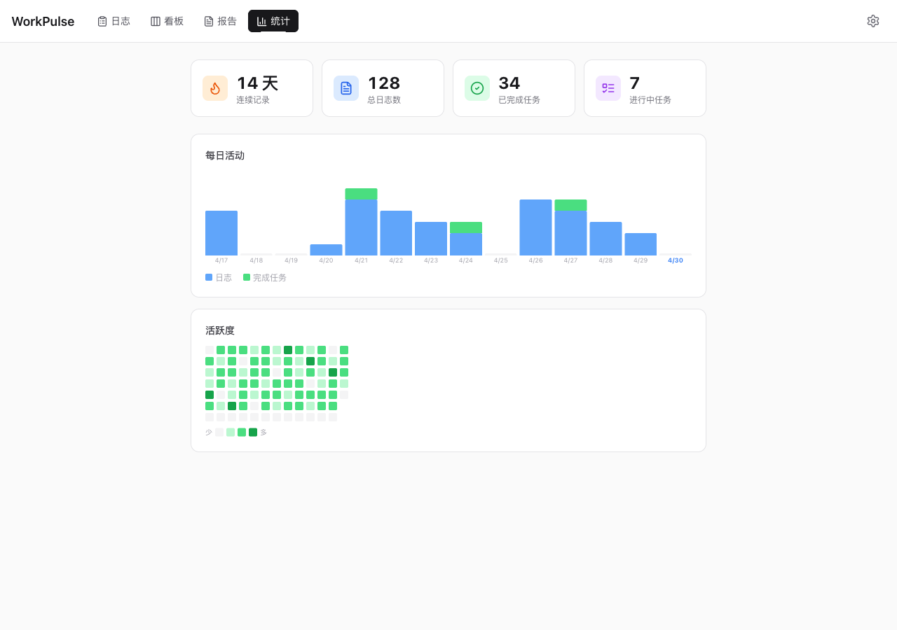

# WorkPulse

[English](./README.md) | [中文](./README.zh-CN.md)

> 让每一份努力被看见

A lightweight desktop app that captures your daily work in seconds — log what you did, track tasks on a kanban board, and generate AI-powered reports.

Built for individual contributors who want a frictionless way to remember what they accomplished each day.

## Screenshots

| Work Log | Kanban |
|----------|--------|
|  |  |

| AI Report | Statistics |
|-----------|------------|
|  |  |

## Features

**Work Log** — Type what you just did, press Enter. That's it. Supports `#tag` for auto-categorization, full-text search, undo delete, and CSV/Markdown export with categories.

**Kanban Board** — Drag tasks between Todo → In Progress → Done. Includes a draft box for "maybe later" ideas, due date tracking, and inline editing. Completing a task auto-generates a work log entry.

**AI Reports** — Select a date range, get a structured summary of your work. Reports use both work logs and task context, support OpenAI/Anthropic-compatible providers, and can be previewed, edited, saved to history, copied, or exported.

**Statistics** — 14-day activity bar chart, GitHub-style heat map, streak counter, and task completion metrics.

**Quick Capture** — Configurable global shortcuts (`Ctrl+Shift+L` for logs, `Ctrl+Shift+T` for tasks by default) let you record without switching windows. Quick logs also support `#tag` parsing and are accessible from the menu bar tray icon.

**Dark Mode** — System, light, or dark theme with full UI coverage. Windows 11 Mica effect support for native translucent surfaces.

**Languages** — English and Chinese UI with a system-default option. Menus, tray actions, settings, exports, and default AI report prompts follow the selected language.

**Auto Updates** — Packaged builds check GitHub Releases for newer versions, download updates in the background, and install after restart. Settings also includes a manual update check.

**Windows Mica Effect** — Native Windows 11 Mica material for title bar and navigation, creating a seamless integration with the desktop environment.

## Tech Stack

- **Electron** + **React** + **TypeScript**
- **Vite** via electron-vite for fast builds
- **SQLite** (better-sqlite3) for local-first data storage
- **Zustand** for state management
- **@dnd-kit** for drag-and-drop
- **Tailwind CSS** for styling
- **talex-mica-electron** for Windows Mica effect

## Getting Started

```bash
# Install dependencies
npm install

# Run in development
npm run dev

# Build for production
npm run build

# Package for distribution
npm run dist:mac    # macOS (DMG + ZIP, x64 + arm64)
npm run dist:win    # Windows (NSIS installer)
npm run dist:linux  # Linux (AppImage)
```

## Installation

### macOS

Because the build is unsigned, macOS Gatekeeper will mark the app as "damaged" on first launch. After dragging `WorkPulse.app` to `/Applications`, run this once in Terminal to clear the quarantine attribute:

```bash
xattr -cr /Applications/WorkPulse.app
```

Then open the app normally.

### Windows

Download the NSIS installer from [Releases](../../releases). Run the installer and follow the prompts. The app will be installed to your Program Files directory.

## Release Builds

GitHub Actions builds release artifacts for macOS, Windows, and Linux when a `v*` tag is pushed, or when the `Release` workflow is run manually.

```bash
git tag v0.2.0
git push origin v0.2.0
```

The workflow uploads DMG/ZIP, NSIS/portable EXE, AppImage, and DEB artifacts to the GitHub Release. Builds are unsigned by default; add signing secrets later if you need notarized macOS or signed Windows installers.

Packaged apps use the same GitHub Release metadata (`latest.yml`, `latest-mac.yml`, `latest-linux.yml`) for automatic update checks.

## Keyboard Shortcuts

| Shortcut | Action |
|----------|--------|
| `⌘1` / `Ctrl+1` | Switch to Work Log |
| `⌘2` / `Ctrl+2` | Switch to Kanban |
| `⌘3` / `Ctrl+3` | Switch to Reports |
| `⌘4` / `Ctrl+4` | Switch to Stats |
| `⌘,` / `Ctrl+,` | Settings |
| `Ctrl+Shift+L` | Quick log (global) |
| `Ctrl+Shift+T` | Quick task (global) |

## Data & Security

All data is stored locally in SQLite at your system's app data directory. Automatic daily backups are created. API keys are stored through Electron secure storage when available, with migration cleanup for legacy plaintext keys. No cloud, no account, no telemetry.

## License

MIT
